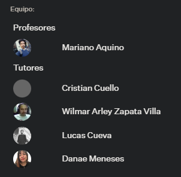
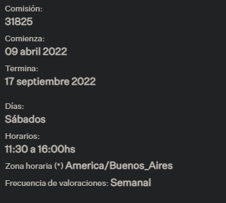

# 🚀 Bienvenido a Backend Coderhouse: Proyecto Final!


- **Comision:** 31825

- **Profesor:** Mariano Aquino

- **Tutor:** Cristian Cuello

- **Alumno:** Alejandro Gabriel Otero


## ⭐ Acerca del proyecto

---

Proyecto backend donde se implementa un API e-commerce para poder vender productos.

# Prueba todas las opciones de la api

---

```

{
    ADMIN_MAIL: "locolajefa@gmail.com"
}

```

Para testear la api incluido en config.env


# Estructura del proyecto

---

```

├── configs
├── logs
├── node_modules
├── src
│   ├── args
│   ├── connections
│   ├── containers
│   ├── controllers
│   ├── daos
│   ├── factory
│   ├── jsonwebtoken
│   ├── middlewares
│   ├── repository
│   ├── routers
│   ├── server
│   └── service
├── .gitignore
├── package-lock.json
├── package.json
├── README.md
└── server.js

```

# Agradecimiento

---

Especial agradecimiento a Marian que se puso la 10 y le metio buena onda durante la cursada entera.



Formato de curso final para terminar la carrera.

